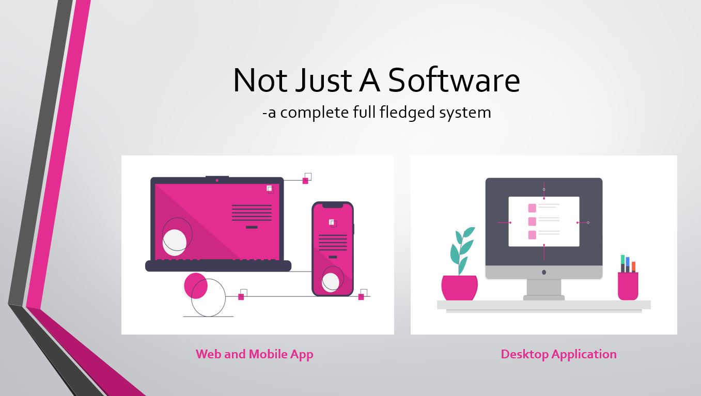

## AnyERP
ANYERP is an online web-based billing and inventory management system which integrates
the product analysis and the history of the bill generated in a period. It will reduce the human
efforts in maintaining invoice logs and the product details including the price, product code,
taxes and all others details. It can be easily accessible from every platform such as tablets,
mobiles, computers etc dur to its responsive behaviour.
 

 

#### The Need for the Project

Manual management of inventory is a cumbersome task when it comes to a large stock in a
company. Project ANYERP looks into this matter and automates this process. Other than
inventory management, ANYERP is capable of managing bills and other product details. In
the current context, getting statistical information about the product of a brand and a set of products needs extra effort to do sell separately. ANYERP provides a solution to this problem by providing automatically generated statistical information in many aspects.

1. Product quality
2. Product availability
3. Maintenance
4. Overall statistical distribution in a product

#### Features of AnyERP

Provide both Web and mobile support
Includes regular updates
Support online and offline with sync feature
Access from anywhere around the world

#### Note

[Click here](Report\BinaryBeast_AnyErp.pdf) read the documentation
